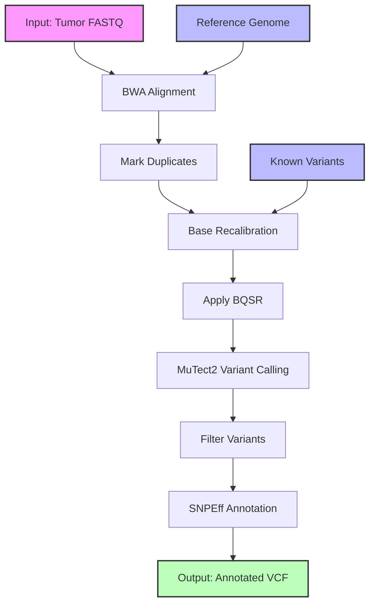

# Tumor Exome Analysis Workflow Documentation

## Overview
This document describes a Common Workflow Language (CWL) implementation of a tumor exome analysis pipeline. The workflow is designed to process tumor exome sequencing data, from raw FASTQ files to annotated variants, implementing best practices for somatic variant discovery.

## Workflow Diagram



### Diagram Legend
- Pink boxes: Initial inputs (FASTQ files)
- Blue boxes: Reference data (Reference genome, Known variants)
- Green boxes: Final outputs (Annotated VCF)
- White boxes: Processing steps

## Workflow Steps Description

1. **BWA Alignment**
   - Tool: BWA-MEM
   - Input: Paired-end FASTQ files
   - Output: Aligned BAM file
   - Purpose: Aligns raw sequencing reads to the reference genome

2. **Mark Duplicates**
   - Tool: GATK MarkDuplicates
   - Input: Aligned BAM
   - Output: Deduplicated BAM
   - Purpose: Identifies and marks PCR duplicates

3. **Base Recalibration**
   - Tool: GATK BaseRecalibrator
   - Input: Deduplicated BAM
   - Output: Recalibration table
   - Purpose: Generates base quality score recalibration table

4. **Apply BQSR**
   - Tool: GATK ApplyBQSR
   - Input: Deduplicated BAM and recalibration table
   - Output: Recalibrated BAM
   - Purpose: Applies base quality score recalibration

5. **Variant Calling**
   - Tool: GATK MuTect2
   - Input: Recalibrated BAM
   - Output: Raw VCF
   - Purpose: Calls somatic variants

6. **Variant Filtration**
   - Tool: GATK FilterMutectCalls
   - Input: Raw VCF
   - Output: Filtered VCF
   - Purpose: Filters low-quality variant calls

7. **Variant Annotation**
   - Tool: SNPEff
   - Input: Filtered VCF
   - Output: Annotated VCF
   - Purpose: Annotates variants with functional predictions

## CWL Implementation

```yaml
#!/usr/bin/env cwl-runner

cwlVersion: v1.2
class: Workflow
label: Tumor Exome Analysis Pipeline

requirements:
  MultipleInputFeatureRequirement: {}
  ScatterFeatureRequirement: {}
  SubworkflowFeatureRequirement: {}
  InlineJavascriptRequirement: {}

inputs:
  tumor_fastq_1: File
  tumor_fastq_2: File
  reference_genome: File
  known_variants: File
  dbsnp: File

outputs:
  filtered_vcf:
    type: File
    outputSource: variant_annotation/annotated_vcf
  alignment_stats:
    type: File
    outputSource: alignment/alignment_stats
  variant_stats:
    type: File
    outputSource: variant_calling/variant_stats

steps:
  alignment:
    run: bwa-mem.cwl
    in:
      fastq_1: tumor_fastq_1
      fastq_2: tumor_fastq_2
      reference: reference_genome
    out: [aligned_bam, alignment_stats]

  mark_duplicates:
    run: gatk-markduplicates.cwl
    in:
      input_bam: alignment/aligned_bam
    out: [dedup_bam, metrics_file]

  base_recalibration:
    run: gatk-baserecalibrator.cwl
    in:
      input_bam: mark_duplicates/dedup_bam
      reference: reference_genome
      known_sites: known_variants
      dbsnp: dbsnp
    out: [recal_table]

  apply_bqsr:
    run: gatk-applybqsr.cwl
    in:
      input_bam: mark_duplicates/dedup_bam
      recal_table: base_recalibration/recal_table
      reference: reference_genome
    out: [recal_bam]

  variant_calling:
    run: gatk-mutect2.cwl
    in:
      input_bam: apply_bqsr/recal_bam
      reference: reference_genome
      dbsnp: dbsnp
    out: [raw_vcf, variant_stats]

  variant_filtration:
    run: gatk-filtermutectcalls.cwl
    in:
      input_vcf: variant_calling/raw_vcf
      reference: reference_genome
    out: [filtered_vcf]

  variant_annotation:
    run: snpeff.cwl
    in:
      input_vcf: variant_filtration/filtered_vcf
      reference: reference_genome
    out: [annotated_vcf]
```

## Workflow Inputs
- tumor_fastq_1: Forward reads FASTQ file
- tumor_fastq_2: Reverse reads FASTQ file
- reference_genome: Reference genome FASTA file
- known_variants: VCF file of known variants
- dbsnp: dbSNP database VCF file

## Workflow Outputs
- filtered_vcf: Final annotated variant calls
- alignment_stats: BWA alignment statistics
- variant_stats: MuTect2 variant calling statistics

## Usage Notes
1. Ensure all required tools (BWA, GATK, SNPEff) are installed and accessible
2. Reference files should be properly indexed
3. Input FASTQ files should be quality-checked before running the pipeline
4. Monitor computational resources as this pipeline can be resource-intensive

## Resource Requirements
- Minimum 32GB RAM recommended
- Multi-core processor (8+ cores recommended)
- Sufficient storage for intermediate files (>100GB recommended)
- High-performance storage system for optimal I/O performance

## Error Handling
The workflow includes basic error handling through CWL. Common points of failure include:
- Insufficient computational resources
- Missing or corrupt input files
- Incorrect reference genome indices
- Tool-specific errors

Monitor log files and pipeline outputs regularly during execution.