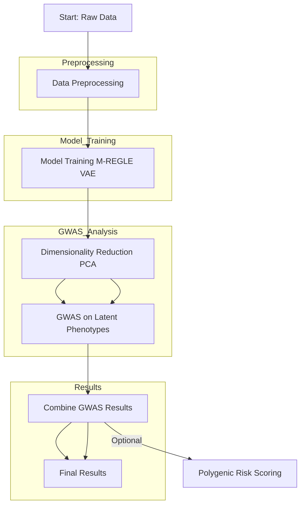

# CWL Workflow for M-REGLE on Seven Bridges

- [Introduction](#introduction)
- [Workflow Overview](#workflow-overview)
- [Step 1: Data Preprocessing](#step-1-data-preprocessing)
- [Step 2: Model Training (VAE)](#step-2-model-training-vae)
- [Step 3: Dimensionality Reduction (PCA)](#step-3-dimensionality-reduction-pca)
- [Step 4: GWAS on Latent Phenotypes](#step-4-gwas-on-latent-phenotypes)
- [Step 5: Combine GWAS Results](#step-5-combine-gwas-results)
- [(Optional) Step 6: Polygenic Risk Score Calculation](#optional-step-6-polygenic-risk-score-calculation)
- [Assembling the CWL Workflow](#assembling-the-cwl-workflow)
- [Running the Workflow (Demo)](#running-the-workflow-demo)
- [Conclusion](#conclusion)

## Introduction  
Reproducing the M-REGLE analysis pipeline on the Seven Bridges platform requires orchestrating multiple tasks – from data preprocessing and model training to GWAS and result aggregation. Using the Common Workflow Language (CWL) to define this pipeline ensures the process is **portable and reproducible** across environments ([Working with CWL - Seven Bridges](https://www.sevenbridges.com/cwl-seven-bridges-platforms/#:~:text=Seven%20Bridges%20is%20committed%20to,to%20describe%20all%20tools%20and)). This section provides an end-to-end CWL workflow for running M-REGLE, complete with step-by-step instructions. We will use bioinformatics containers whenever possible (from Biocontainers/Bioconda), and provide a Dockerfile for any custom components. The goal is a one-shot runnable workflow: a single execution that takes raw inputs (e.g. waveform data and genotypes) and outputs combined GWAS results and risk scores, without manual intervention in between steps. By following the structured instructions and YAML descriptions below, students and researchers can successfully execute the M-REGLE demo on Seven Bridges or any CWL-compatible platform.

## Workflow Overview  
The M-REGLE CWL workflow consists of several stages, each encapsulated as a separate tool or sub-workflow. The major steps are:  

1. **Data Preprocessing:** Format and standardize the input high-dimensional data from multiple modalities. For example, combine or normalize ECG and PPG signals per individual into a single data matrix ready for model input.  
2. **Model Training (M-REGLE VAE):** Train the convolutional VAE on the multimodal training data to learn latent representations. Save the trained model and/or the latent embeddings for all individuals.  
3. **Dimensionality Reduction:** Apply PCA to the latent embeddings to produce uncorrelated principal components. Output the top components as phenotype variables for GWAS.  
4. **GWAS on Latent Phenotypes:** Run genome-wide association analyses for each principal component using a tool like REGENIE or PLINK, taking genotypic data (e.g. UKB imputed variants or a provided demo genotype set) as input.  
5. **Results Combination:** Combine the per-PC GWAS results to identify overall significant loci. This may involve summing statistics and calculating joint p-values, then producing a consolidated list of genome-wide significant variants/loci.  
6. **Polygenic Risk Scoring (optional):** Using the significant variants, calculate a polygenic risk score. This can be done by training a penalized regression (elastic net) on one dataset and evaluating on another, or simply applying score weights if provided. (For the demo, this step might be a simplified scoring using effect sizes from GWAS or a dummy evaluation since full PRS training may require additional phenotype data.)


Each of these steps will be implemented as either a CWL **CommandLineTool** (wrapping a script or binary execution) or a CWL **Workflow** (to group sub-steps). We will now walk through the setup and CWL definitions for each part.

## Step 1: Data Preprocessing  
**Purpose:** Prepare input data for the M-REGLE model. In our example, suppose we have two modalities per individual: an ECG waveform and a PPG waveform stored as CSV files. The preprocessing step might normalize these signals, combine them into a unified format (e.g., merge as multiple channels), and split the dataset if needed.

**Implementation:** We assume a Python script `prep_data.py` is provided in the demo, which reads raw data files and outputs a processed NumPy `.npz` or CSV containing the combined multimodal data for each individual. This script could also perform train/validation split and output those indices or files. We will containerize this step using a lightweight SciPy/Pandas environment (since it’s mainly data manipulation). A suitable base image is the official BioContainers image for Python with scientific libraries, or we can define a custom Docker. Here’s an example **Dockerfile** for preprocessing (only needed if no existing container fits):

```Dockerfile
FROM python:3.9-slim

RUN pip install numpy pandas scipy

# Copy the preprocessing script into the container
COPY prep_data.py /opt/
WORKDIR /opt/

ENTRYPOINT ["python", "prep_data.py"]
```

We build this image and push to a registry (if running on Seven Bridges, the image can be added to the project). For the CWL tool definition, we specify how inputs (raw data files, parameters) map to the script’s arguments. For instance, our script might take arguments like `--ecg <file> --ppg <file> --out <output_prefix>`.

**CWL Tool (Preprocessing):** Below is a CWL CommandLineTool for the preprocessing step (saved as `mregle_preprocess.cwl`):

```yaml
cwlVersion: v1.2
class: CommandLineTool
label: "M-REGLE Data Preprocessing"
baseCommand: ["python", "/opt/prep_data.py"]
requirements:
  - class: DockerRequirement
    dockerPull: "docker.io/username/mregle_preprocess:latest"  # use the built image
inputs:
  ecg_file:
    type: File
    inputBinding:
      prefix: "--ecg"
  ppg_file:
    type: File?
    inputBinding:
      prefix: "--ppg"
  output_prefix:
    type: string
    default: "mregle_prep"
    inputBinding:
      prefix: "--out"
outputs:
  processed_data:
    type: File
    outputBinding:
      glob: "${ inputs.output_prefix }.npz"
```

**Explanation:** This tool takes an ECG file and an optional PPG file as inputs (if only one modality, the PPG could be null or omitted). It runs `prep_data.py` inside the container, specifying the input files and an output prefix. The output is expected to be a NumPy compressed file (`.npz`) named with the given prefix (the script should create `mregle_prep.npz` in this case). We use `glob` to capture that file as the output of the tool. In practice, the `.npz` might contain arrays: e.g., an array of shape (N, 600, 2) for N samples of a 2-channel (ECG+PPG) waveform dataset, plus maybe train/test splits indices. The specifics depend on the demo data format.

After running this step, we have our data ready for modeling. In a real run, if splitting is required, we might produce separate files for train and validation sets. For simplicity, we assume one processed dataset file and possibly will pass an index range or fraction to the training step for what part to use for training vs. validation.

## Step 2: Model Training (VAE)  
**Purpose:** Train the M-REGLE VAE on the processed multimodal data to learn latent embeddings. This involves running a training script (potentially for several epochs) and then outputting the trained model parameters and the latent representations of the data.

**Implementation:** The training will likely be done with a deep learning framework (TensorFlow, PyTorch, or JAX). For the demo, if training from scratch is time-consuming, one might use a pre-trained model or train for only a few epochs on a small subset to illustrate the workflow. The code for training (e.g., `train_mregle.py`) should accept inputs for the training data file, hyperparameters (like latent dimension, epochs), and output file paths for the learned model and the latent embeddings. We will use a container that has the needed ML framework. If a public container (Biocontainer) is available (e.g., a TensorFlow 2.x or PyTorch image), we use that. Otherwise, we create a custom Docker. For example, using PyTorch:

```Dockerfile
FROM pytorch/pytorch:1.13.1-cuda11.6-cudnn8-runtime  # contains Python, PyTorch, etc.
WORKDIR /opt/
COPY train_mregle.py /opt/
RUN pip install numpy scipy scikit-learn  # if needed for PCA or other utilities
ENTRYPOINT ["python", "/opt/train_mregle.py"]
```

We include scikit-learn if we plan to perform PCA or other analysis in the same script. Build and push this as `username/mregle_train:latest`.

**CWL Tool (Training):** Now the CWL for the training step (`mregle_train.cwl`):

```yaml
cwlVersion: v1.2
class: CommandLineTool
label: "Train M-REGLE VAE Model"
baseCommand: ["python", "/opt/train_mregle.py"]
requirements:
  - class: DockerRequirement
    dockerPull: "docker.io/username/mregle_train:latest"
inputs:
  data_file:
    type: File
    inputBinding:
      prefix: "--data"
  latent_dim:
    type: int?
    default: 96
    inputBinding:
      prefix: "--latent_dim"
  epochs:
    type: int?
    default: 50        # for demo, a smaller number of epochs
    inputBinding:
      prefix: "--epochs"
  output_prefix:
    type: string
    default: "mregle_model"
    inputBinding:
      prefix: "--out"
outputs:
  model_file:
    type: File
    outputBinding:
      glob: "${ inputs.output_prefix }.pth"    # assuming PyTorch model output
  embeddings:
    type: File
    outputBinding:
      glob: "${ inputs.output_prefix }_embeddings.csv"
```

**Explanation:** This tool runs the training script inside the PyTorch container. We pass the preprocessed data file (`--data mregle_prep.npz`), the latent dimension (default 96, matching the paper for 12-lead ECG), and number of training epochs. The script is expected to save two outputs: the trained model (here we expect a PyTorch `.pth` file) and the latent embeddings for all data points (e.g., a CSV with one row per individual and 96 latent values, or perhaps an `.npy`). We capture these with glob patterns based on the provided `--out` prefix. In this case, if `--out mregle_model` is given, we anticipate `mregle_model.pth` and `mregle_model_embeddings.csv` to be created. The embeddings file will be used in the next step for PCA. 

*Note:* In an actual scenario, one might also output separate embeddings for training vs validation sets. For simplicity, assume the script outputs combined embeddings or just training embeddings if we only GWAS on the training set individuals. If needed, the workflow can be adjusted to only use those individuals with genotypes available (likely all of them in the dataset).

## Step 3: Dimensionality Reduction (PCA)  
**Purpose:** Take the learned embeddings and compute principal components to ensure they are uncorrelated. We will reduce the dimensionality if needed (for example, the VAE might have more latent features than needed, or we only take top N components explaining most variance). Each principal component will become a phenotype for GWAS.

**Implementation:** We can use a small Python or R script to perform PCA. Since the training container already had scikit-learn installed, we could actually incorporate PCA in the training script. However, to keep the workflow modular, we separate it as its own step. This also makes it easier to adjust the number of components at runtime. We will use Python with scikit-learn PCA for this example. The script (`compute_pca.py`) will read the embeddings CSV, run PCA (possibly on standardized data), and output two things: (a) a CSV of the principal component values for each individual, and (b) optionally the PCA model or explained variance info (not strictly needed for the pipeline, but could be saved for analysis).

We can reuse the same Python environment as the training (since it has numpy/sklearn). For clarity, we could still wrap it in a separate CWL tool but even reuse the same Docker image. Let’s define a tool using the same container:

```yaml
cwlVersion: v1.2
class: CommandLineTool
label: "Compute PCA on embeddings"
baseCommand: ["python", "/opt/compute_pca.py"]
requirements:
  - class: DockerRequirement
    dockerPull: "docker.io/username/mregle_train:latest"   # reuse training image which has Python libs
inputs:
  embeddings_csv:
    type: File
    inputBinding:
      prefix: "--embeddings"
  n_components:
    type: int?
    default: 96    # default to full, can reduce if needed
    inputBinding:
      prefix: "--n_components"
  output_prefix:
    type: string
    default: "mregle_pca"
    inputBinding:
      prefix: "--out"
outputs:
  pc_csv:
    type: File
    outputBinding:
      glob: "${ inputs.output_prefix }_PCs.csv"
```

**Explanation:** `compute_pca.py` will produce a file like `mregle_pca_PCs.csv` containing, say, one row per individual and columns for each principal component (with perhaps an ID column). If `n_components` is less than the input dimension, it will output that many PCs. In the 12-lead ECG case, one might keep all 96 (since they used all for GWAS) or potentially fewer if desired. We default to the full number. This CSV will serve as the phenotype input to GWAS.

## Step 4: GWAS on Latent Phenotypes  
**Purpose:** Perform genome-wide association tests for each principal component trait using genotype data. In a research setting, this means running a GWAS tool on a large genotype dataset with quantitative phenotypes. For the demo, we might use a small subset of variants or synthetic genotype data to make it runnable, but the workflow structure remains the same.

**Inputs needed:** We require genotype data for the individuals. Typically, this would be in PLINK format (BED/BIM/FAM files) or VCF, and a sample mapping to the phenotype file. We also need covariates (like age, sex, etc.) if we want to include those. For simplicity, we may skip covariates in the demo or assume they are part of the phenotype file.

**Tool choice:** The original study used REGENIE ([Utilizing multimodal AI to improve genetic analyses of cardiovascular traits | medRxiv](https://www.medrxiv.org/content/10.1101/2024.03.19.24304547v1.full-text#:~:text=of%20the%2096%20PCs%20using,values%20to)), which is efficient for large data. We can use REGENIE (available via Bioconda) or PLINK 2.0 for simplicity. Both have Biocontainers. Let’s assume we use REGENIE in two steps (as recommended): a null model fitting and then association. Given a small demo, we might simplify to one step linear regression per PC using PLINK’s `--pheno` and `--linear`. To illustrate, we’ll use PLINK here (it’s easier for a quick demo and widely known).

**CWL Tool (GWAS):** We create a tool that takes genotype files and a phenotype file and runs association tests. If using PLINK, the base command could be `plink2 --bfile data --pheno pcs.csv --pheno-name PC1 --covar covar.txt ...`. However, since we have potentially multiple PCs, we have two options: (a) run a separate CWL job for each PC (which we can do using CWL scatter or multiple defined steps), or (b) run a single job that analyzes all PCs in one go. PLINK can output association results for multiple phenotypes in one run if each is a column in the pheno file, by specifying `--linear` which will output a separate file per phenotype. That might be convenient. Let’s do that: assume `pcs.csv` has columns `FID, IID, PC1, PC2, ..., PCn`. We run PLINK once with `--linear` and it will produce `plink.PC1.linear`, `plink.PC2.linear`, etc., each containing association results.

We use the official plink2 container from Biocontainers (for example, `quay.io/biocontainers/plink2:2.3[...]`). The CWL (`gwas_plink.cwl`) might look like:

```yaml
cwlVersion: v1.2
class: CommandLineTool
label: "GWAS with PLINK"
baseCommand: ["plink2"]
requirements:
  - class: DockerRequirement
    dockerPull: "quay.io/biocontainers/plink2:2.3.7--hcdd50e1_0"  # example biocontainer for plink2
inputs:
  genotype_prefix:
    type: string
    inputBinding:
      prefix: "--bfile"
  phenotype_file:
    type: File
    inputBinding:
      prefix: "--pheno"
  covariate_file:
    type: File?
    inputBinding:
      prefix: "--covar"
  covariate_names:
    type: string?
    inputBinding:
      prefix: "--covar-name"
  output_prefix:
    type: string
    default: "mregle_gwas"
    inputBinding:
      prefix: "--out"
  assoc_mode:
    type: string?
    default: "linear"
    inputBinding:
      prefix: "--glm"   # Using PLINK2 --glm which covers linear/logistic
outputs:
  assoc_results:
    type: Directory
    outputBinding:
      glob: "${ inputs.output_prefix }.PC*.${ inputs.assoc_mode }.*"
```

**Explanation:** This tool assumes the genotype data is provided as a path prefix (for `--bfile` pointing to `.bed/.bim/.fam`). The phenotype CSV is given to `--pheno`. We also allow an optional covariate file if available (with `--covar`). We call `plink2` with `--glm linear` (equivalent to linear regression for quantitative traits in PLINK2). PLINK will name output files using the `--out` prefix and the phenotype name. For each PC column in the pheno file, it will produce a `.linear` results file (or `.glm.linear` depending on version). The outputs section is capturing all files that match `mregle_gwas.PC*.linear.*` (for example, `mregle_gwas.PC1.linear` etc.) as a directory of results. We could instead list them individually, but since the number of PCs can vary, treating them as a directory of outputs is convenient.

After this step, we will have association result files for each principal component. Each file typically contains columns like SNP ID, effect size, p-value, etc., for that PC.

## Step 5: Combine GWAS Results  
**Purpose:** Merge the association findings from all PCs to identify overall significant variants and loci, as described by the M-REGLE approach. This involves statistical combination (summing chi-square statistics) and then determining significance based on the combined p-values.

**Implementation:** We create a Python or R script `combine_gwas.py` that reads all the `.linear` result files and performs the following: for each variant (identified by a variant ID or genomic position), aggregate the chi-square statistics from all PC-specific tests. If $p_i$ is the p-value for variant *v* in PC *i*’s GWAS, we convert that to $\chi^2_{1}$ (with 1 degree of freedom) via $\chi^2 = F^{-1}(1-p_i; 1)$ (or simpler: use the provided test statistic from PLINK directly if available, e.g., t-stat or beta and SE to get chi-square). Then we sum these to get $\chi^2_{combined}$. The combined degrees of freedom = number of PCs (say k). We then compute a combined p-value $p_{\text{combined}} = 1 - F_{\chi^2_k}(\chi^2_{combined})$. Mark variants that are genome-wide significant (e.g., $p<5\times10^{-8}$). We may also cluster nearby significant SNPs into loci (this could be more involved, possibly skipping in a simple demo). The script will output a final CSV of combined results, perhaps with columns: Variant, ChiSq_combined, p_combined, and an indicator if significant.

We will use the Python environment again (could reuse the training container or any container with numpy/scipy since this is purely analysis). For simplicity, add this as another step in our workflow using the same container as PCA (which has numpy/scipy). 

**CWL Tool (Combine Results):** `combine_results.cwl`:

```yaml
cwlVersion: v1.2
class: CommandLineTool
label: "Combine GWAS results from PCs"
baseCommand: ["python", "/opt/combine_gwas.py"]
requirements:
  - class: DockerRequirement
    dockerPull: "docker.io/username/mregle_train:latest"
inputs:
  gwas_dir:
    type: Directory
    inputBinding:
      prefix: "--gwas_dir"
  output_file:
    type: string
    default: "combined_results.csv"
    inputBinding:
      prefix: "--out"
outputs:
  combined_results:
    type: File
    outputBinding:
      glob: "${ inputs.output_file }"
```

**Explanation:** This tool takes a directory of GWAS results (the output from the previous PLINK step) and an output file name. The script `combine_gwas.py` should iterate over all files in `--gwas_dir` (which contain the per-PC results) and perform the combination logic. The final CSV (e.g. `combined_results.csv`) is captured as the output. If we were to also do a PRS calculation, that could either be integrated here or as a separate step (e.g., a script that uses the combined results to score individuals). For now, we conclude the pipeline with the combined results, which enumerate the significant loci.

## (Optional) Step 6: Polygenic Risk Score Calculation  
If the workflow includes PRS evaluation, an additional step would train or apply a PRS model. For example, using the combined significant variants, one could use PLINK to calculate polygenic score for individuals (with `--score` command if weights are available) or use an R script with `glmnet`. Since this can be highly specific and might require separate phenotype data, we mark it as optional. In a classroom demo, this step might simply read the `combined_results.csv`, take variants below a p-value threshold, and output a dummy risk score file or some evaluation metrics.

If needed, it could be implemented similarly with a script (e.g., `compute_prs.py`) and a CWL tool, using an appropriate container (R or Python with scikit-learn). The inputs would be the combined results, genotype data, and perhaps a list of target individuals, producing a file of PRS per individual. Due to complexity, we won’t detail it here, but the pattern would mirror previous steps.

## Assembling the CWL Workflow  
With individual tools defined, we now create the top-level CWL workflow (`mregle_workflow.cwl`) that links them together. The workflow will pass outputs from one step to the next as inputs accordingly. 


Here’s a streamlined version of the workflow YAML:

```yaml
cwlVersion: v1.2
class: Workflow
label: "End-to-End M-REGLE Workflow"
inputs:
  ecg_input: File
  ppg_input: File?
  genotype_prefix: string   # prefix path to .bed/.bim/.fam (assuming they are in the same directory or mounted)
  covar_file: File?
outputs:
  results: File <- combine_results/combined_results
steps:
  preprocess:
    run: mregle_preprocess.cwl
    in:
      ecg_file: ecg_input
      ppg_file: ppg_input
    out: [processed_data]
  train:
    run: mregle_train.cwl
    in:
      data_file: preprocess/processed_data
    out: [model_file, embeddings]
  pca:
    run: compute_pca.cwl
    in:
      embeddings_csv: train/embeddings
    out: [pc_csv]
  gwas:
    run: gwas_plink.cwl
    in:
      genotype_prefix: genotype_prefix
      phenotype_file: pca/pc_csv
      covariate_file: covar_file
    out: [assoc_results]
  combine_results:
    run: combine_results.cwl
    in:
      gwas_dir: gwas/assoc_results
    out: [combined_results]
```

**Explanation:** In the `inputs` section of the workflow, we expect an ECG file, an optional PPG file, the genotype file prefix (note: on Seven Bridges, you might provide these as separate File inputs and then use `dirname` and `basename` if needed; for simplicity using a prefix string is one way if the files are already localized), and optionally a covariate file. The `outputs` of the workflow is the final combined results file coming from the `combine_results` step. Each `step` maps to one of the CWL CommandLineTools we defined:

- `preprocess` takes `ecg_input` and `ppg_input` from workflow inputs and produces `processed_data`.  
- `train` takes the `processed_data` and produces a `model_file` and `embeddings`. (We don’t explicitly use `model_file` downstream, but it could be stored or used if we had a separate encoding step for new data; here the training script likely already produced embeddings for the training set.)  
- `pca` consumes the `embeddings` CSV and outputs `pc_csv`.  
- `gwas` uses `genotype_prefix` (plus internally it will use `.bed/.bim/.fam` files matching that prefix) and the phenotype CSV from PCA. It also optionally takes `covar_file` if provided (wired to `--covar`). The result is a directory of association results.  
- `combine_results` then reads that directory and outputs the final CSV of combined analysis.

This workflow is **one-shot**: as soon as you provide the required inputs (the raw data and genotypes), you can run it to completion. On Seven Bridges, you would upload these CWL descriptions and the Docker images (or use available ones), then execute the workflow via the graphical interface or CLI. The platform will handle scheduling each step, possibly in parallel where applicable. For example, if scatter parallelism was desired for GWAS (running each chromosome separately, etc.), CWL could be extended accordingly; but in our simple design, we run one job for all.

## Running the Workflow (Demo)  
To execute this CWL workflow, you can use a CWL runner locally (like `cwltool`) or through Seven Bridges’ execution environment. Let’s assume local for testing with cwltool:

1. Ensure you have all input files ready:
   - `ecg.csv` – ECG waveform data for individuals.
   - `ppg.csv` – PPG waveform data for the same individuals (if available).
   - `genotypes.bed`, `genotypes.bim`, `genotypes.fam` – genotype files (make sure individual IDs align with those in the phenotype CSV output).
   - `covariates.txt` – (optional) covariate file with columns FID, IID, and covariates like age, sex, etc.

2. Prepare an input YAML (`mregle_inputs.yaml`) referencing these files and parameters, for example: 

```yaml
ecg_input:
  class: File
  path: /path/to/ecg.csv
ppg_input:
  class: File
  path: /path/to/ppg.csv
genotype_prefix: /path/to/genotypes    # note: do not include .bed extension here, just the prefix
covar_file:
  class: File
  path: /path/to/covariates.txt
```

3. Run the workflow with cwltool:  
```bash
cwltool --cachedir=./cwl_cache mregle_workflow.cwl mregle_inputs.yaml
```  
This will pull the required containers (from Docker Hub or Quay) and execute each step in sequence. If running on Seven Bridges, you would upload the CWL and use their runner or GUI which abstracts these details (the input specification would be done through their interface or SB API in JSON format, but conceptually it’s the same mapping of inputs).

4. Monitor the outputs. Upon completion, you should get `combined_results.csv` in the output, which you can download or view. This CSV will list combined p-values for each variant across the latent traits. For example, in the demo it might show a few variant IDs with extremely low p-values that meet significance. If this were the real UK Biobank analysis, this file would contain the 262 hits and their p-values discovered by M-REGLE ([Utilizing multimodal AI to improve genetic analyses of cardiovascular traits | medRxiv](https://www.medrxiv.org/content/10.1101/2024.03.19.24304547v1.full-text#:~:text=hits%20and%20142%20loci%20discovered,square%20statistics%20on%20all%20the)).

5. (Optional) If you included a PRS step, you would also receive a PRS output (e.g., a file of risk scores per individual, or evaluation metrics such as AUC for case/control prediction).

## Conclusion  
By following the above CWL workflow on Seven Bridges, one can reproduce the essential steps of the M-REGLE algorithm in a robust, automated manner. The workflow is modular – each component (preprocessing, training, GWAS) can be swapped or updated as needed. We used BioContainers for established tools like PLINK to ensure compatibility and ease of deployment, while custom steps like model training were containerized with all necessary dependencies (Python libraries, etc.). This end-to-end pipeline not only serves to demonstrate M-REGLE on example data but also illustrates best practices in workflow development: using containers for reproducibility, CWL for clear definition of each stage, and splitting complex processes into manageable steps. Students running this demo will gain hands-on experience with both cutting-edge genomic analysis (via M-REGLE) and the practical skills of executing workflows in a cloud environment. With the provided YAML definitions and instructions, the journey from raw multimodal data to combined genetic insights is fully encapsulated, reflecting the power of CWL and Seven Bridges for empowering research in precision medicine.
