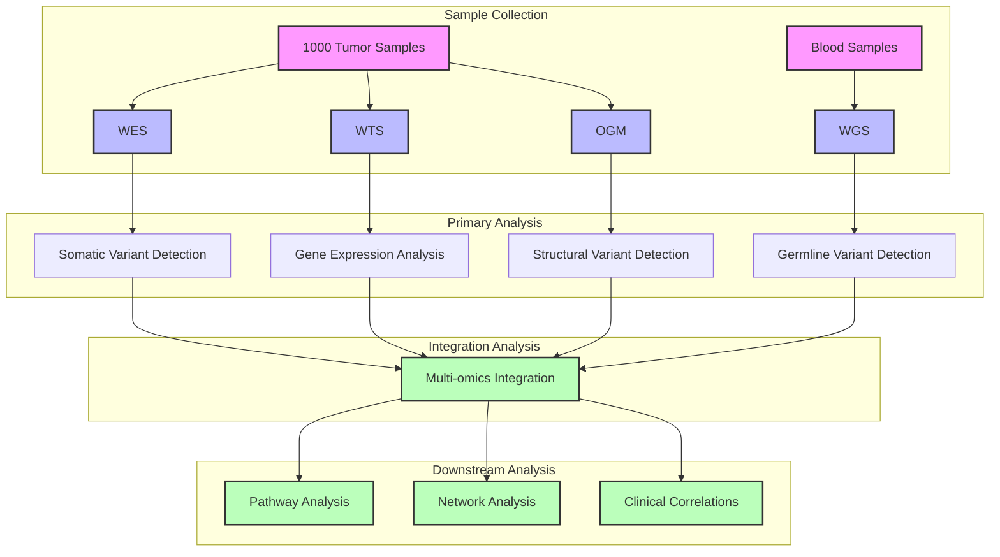

# Multi-omics Cancer Study Overview

## Study Design
This comprehensive multi-omics study investigates cancer biology through multiple molecular layers using a cohort of 1000 tumor samples. The study integrates:

* **Tumor Samples (n=1000)**:
  - Whole Exome Sequencing (WES)
  - Whole Transcriptome Sequencing (WTS)
* **Matched Blood Normal Samples (subset)**:
  - Whole Genome Sequencing (WGS)
* **Additional Data**:
  - Optical Genome Mapping (OGM)

## Sample Overview
### Primary Dataset
- 1000 tumor samples with paired WES and WTS data
- Subset of samples with matched blood normal WGS
- OGM data for structural variant validation

### Data Generation Specifications
1. **Whole Exome Sequencing (WES)**
   - Target coverage: 100X
   - Platform: Illumina NovaSeq
   - Library prep: Agilent SureSelect

2. **Whole Transcriptome Sequencing (WTS)**
   - Target depth: 50M paired-end reads
   - Platform: Illumina NovaSeq
   - Stranded library preparation

3. **Whole Genome Sequencing (WGS)**
   - Target coverage: 30X
   - Platform: Illumina NovaSeq
   - PCR-free library preparation

4. **Optical Genome Mapping**
   - Platform: Bionano Saphyr
   - High molecular weight DNA extraction
   - DLS labeling

## Integrated Analysis Workflow

## Analysis Workflows Integration

### 1. Data Generation and QC
- Initial QC metrics collection for all data types
- Sample identity verification across modalities
- Contamination assessment
- Batch effect monitoring

### 2. Primary Analysis Workflows
Each data type follows its specialized analysis pipeline:

1. **WES Analysis (Workflow 1)**
   - Somatic variant calling
   - Copy number alteration detection
   - Loss of heterozygosity analysis
   - Clonality assessment

2. **WTS Analysis (Workflow 2)**
   - Gene expression quantification
   - Alternative splicing analysis
   - Fusion gene detection
   - Differential expression analysis

3. **WGS Analysis (Workflow 3)**
   - Germline variant calling
   - Structural variant detection
   - Mobile element analysis
   - Large-scale chromosomal alterations

4. **OGM Analysis**
   - Large structural variant detection
   - Copy number variation analysis
   - Validation of WGS findings

### 3. Data Integration
The multi-omics integration strategy includes:

1. **Variant Integration**
   - Cross-validation of variants between WES and WGS
   - Integration with expression data
   - Structural variant confirmation with OGM

2. **Expression Integration**
   - Correlation of variants with expression changes
   - Identification of expression quantitative trait loci (eQTLs)
   - Alternative splicing impact analysis

3. **Network Analysis**
   - Pathway enrichment analysis
   - Protein-protein interaction networks
   - Regulatory network reconstruction

## Expected Outcomes

1. **Genomic Insights**
   - Comprehensive variant landscape
   - Novel driver mutation identification
   - Structural variant characterization

2. **Transcriptomic Impact**
   - Expression signatures
   - Splicing alterations
   - Fusion gene discoveries

3. **Clinical Applications**
   - Biomarker identification
   - Therapeutic target discovery
   - Patient stratification strategies

## Computational Requirements

### Infrastructure Needs
1. **Storage**
   - Raw data: ~X TB
   - Final results: ~X TB

2. **Compute**
   - High-memory nodes (128GB+ RAM)
   - GPU nodes for ML applications
   - High-performance storage system

### Timeline Estimates
1. **Primary Analysis**: 2-3 months
2. **Integration Analysis**: 2-3 months
3. **Downstream Analysis**: 3-4 months
4. **Validation and Report**: 2-3 months

## Quality Control Strategy

### Sample Level QC
1. **WES/WGS**
   - Coverage metrics
   - Variant quality scores
   - Sample contamination

2. **RNA-Seq**
   - Read quality metrics
   - Mapping rates
   - Expression distribution

3. **OGM**
   - Molecule length distribution
   - Label density
   - Map rate

### Batch Effect Management
1. **Technical Factors**
   - Sequencing batches
   - Library preparation dates
   - Operator effects

2. **Biological Factors**
   - Sample collection time
   - Tissue preservation method
   - Patient demographics

## Data Management Plan

### Storage Strategy
1. **Raw Data**
   - Redundant backup
   - Cloud mirror
   - Regular integrity checks

2. **Analysis Results**
   - Structured database
   - Version control
   - Regular backups

### Access Control
1. **Data Security**
   - Encryption at rest
   - Access logging
   - Regular audits

2. **Sharing Protocol**
   - Data access committee
   - Controlled access
   - Public summary statistics

## Notes and Recommendations
1. Regular pipeline validation with control samples
2. Systematic documentation of all protocol deviations
3. Implementation of automated QC reporting
4. Regular team meetings for progress updates
5. Establishment of clear data sharing protocols