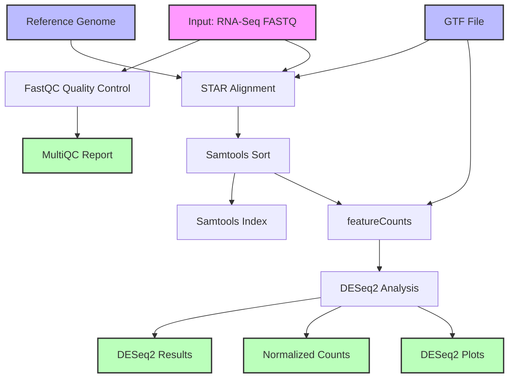

# RNA-Seq Analysis Workflow Documentation

## Overview
This document describes a Common Workflow Language (CWL) implementation of an RNA-Seq analysis pipeline. The workflow processes RNA sequencing data from raw FASTQ files through quality control, alignment, quantification, and differential expression analysis.

## Workflow Diagram



### Diagram Legend
- Pink boxes: Initial inputs (FASTQ files)
- Blue boxes: Reference data (Reference genome, GTF file)
- Green boxes: Final outputs (Results files, reports)
- White boxes: Processing steps

## Workflow Steps Description

1. **Quality Control**
   - Tool: FastQC
   - Input: Paired-end FASTQ files
   - Output: FastQC reports
   - Purpose: Assesses the quality of raw sequencing data

2. **Read Alignment**
   - Tool: STAR
   - Input: FASTQ files, reference genome, GTF file
   - Output: Aligned BAM file
   - Purpose: Maps RNA-seq reads to the reference genome

3. **BAM Processing**
   - Tool: Samtools
   - Steps: 
     - Sort: Orders alignments by genomic coordinates
     - Index: Creates index for fast random access
   - Purpose: Prepares aligned reads for downstream analysis

4. **Expression Quantification**
   - Tool: featureCounts
   - Input: Sorted BAM file, GTF file
   - Output: Raw count matrix
   - Purpose: Counts reads mapped to genomic features

5. **Differential Expression Analysis**
   - Tool: DESeq2
   - Input: Raw count matrix, sample information
   - Outputs: 
     - Differential expression results
     - Normalized counts
     - Visualization plots
   - Purpose: Identifies differentially expressed genes

## CWL Implementation

```yaml
#!/usr/bin/env cwl-runner

cwlVersion: v1.2
class: Workflow
label: RNA-Seq Analysis Pipeline

requirements:
  MultipleInputFeatureRequirement: {}
  ScatterFeatureRequirement: {}
  SubworkflowFeatureRequirement: {}
  InlineJavascriptRequirement: {}

inputs:
  fastq_1: File
  fastq_2: File
  reference_genome: File
  gtf_file: File
  sample_name: string

outputs:
  raw_counts:
    type: File
    outputSource: feature_counts/counts_file
  deseq_results:
    type: File
    outputSource: differential_expression/results_file
  multiqc_report:
    type: File
    outputSource: quality_control/multiqc_report

steps:
  quality_control:
    run: fastqc.cwl
    in:
      fastq_1: fastq_1
      fastq_2: fastq_2
    out: [fastqc_report, multiqc_report]

  read_alignment:
    run: star.cwl
    in:
      fastq_1: fastq_1
      fastq_2: fastq_2
      reference: reference_genome
      gtf: gtf_file
      sample_name: sample_name
    out: [aligned_bam, alignment_stats]

  sort_bam:
    run: samtools-sort.cwl
    in:
      input_bam: read_alignment/aligned_bam
    out: [sorted_bam]

  index_bam:
    run: samtools-index.cwl
    in:
      input_bam: sort_bam/sorted_bam
    out: [bam_index]

  feature_counts:
    run: featurecounts.cwl
    in:
      input_bam: sort_bam/sorted_bam
      gtf: gtf_file
      sample_name: sample_name
    out: [counts_file]

  differential_expression:
    run: deseq2.cwl
    in:
      counts_file: feature_counts/counts_file
      sample_info: sample_name
    out: [results_file, normalized_counts, plots]
```

## Workflow Inputs
- fastq_1: Forward reads FASTQ file
- fastq_2: Reverse reads FASTQ file
- reference_genome: Reference genome FASTA file
- gtf_file: Gene annotation file in GTF format
- sample_name: Sample identifier

## Workflow Outputs
- raw_counts: Feature counts matrix
- deseq_results: Differential expression analysis results
- multiqc_report: Quality control summary report

## Usage Notes
1. Ensure all required tools (STAR, Samtools, featureCounts, DESeq2) are installed
2. Reference genome should be indexed for STAR alignment
3. Input FASTQ files should be quality-checked
4. GTF file should be compatible with the reference genome version

## Resource Requirements
- Minimum 32GB RAM recommended (64GB+ for STAR alignment)
- Multi-core processor (8+ cores recommended)
- Sufficient storage for intermediate files (>100GB recommended)
- High-performance storage system for optimal I/O performance

## Error Handling
Common points of failure include:
- Insufficient memory during STAR alignment
- Incompatible versions between GTF and reference genome
- Malformed input files
- Resource exhaustion during BAM sorting

Monitor log files and pipeline outputs regularly during execution.

## Quality Control Points
1. Initial FastQC reports for raw data quality
2. STAR alignment rates
3. Feature assignment rates from featureCounts
4. Sample clustering patterns in DESeq2
5. MultiQC summary metrics

## Best Practices
1. Start with high-quality input data
2. Use consistent genome and annotation versions
3. Monitor computational resources
4. Implement appropriate filtering thresholds
5. Validate results through visualization