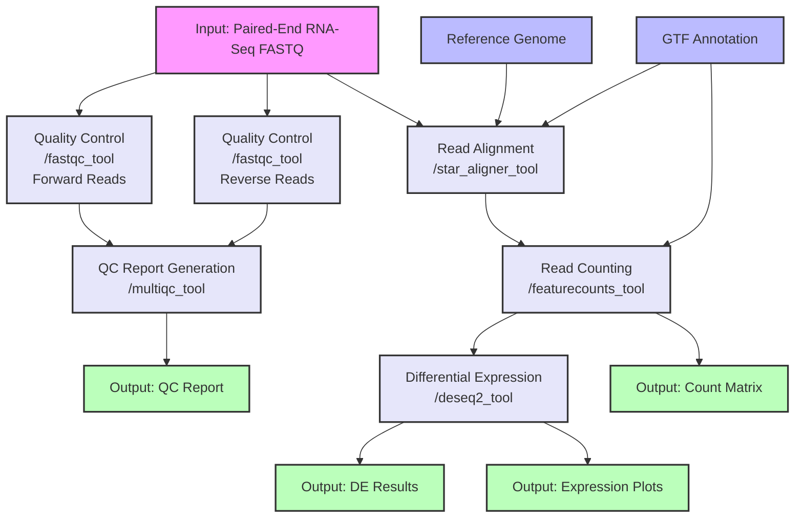

# RNA-Seq Analysis Workflow Documentation

## Overview
This document describes a Common Workflow Language (CWL) implementation of an RNA-Seq analysis pipeline using specific tools from our tool library. The workflow processes RNA sequencing data from raw FASTQ files through quality control, alignment, quantification, and differential expression analysis.

## Workflow Diagram



### Diagram Legend
- Pink boxes: Initial inputs (FASTQ files)
- Blue boxes: Reference data (Reference genome, GTF annotation)
- Green boxes: Final outputs (Count matrix, DE results, QC reports)
- Lavender boxes: Processing steps (with specific tool IDs)

## Workflow Steps Description

1. **Quality Control**
   - Tool: `fastqc_tool` from qc_tools.cwl
   - Container: biocontainers/fastqc:0.11.9
   - Resources: 4GB RAM, 1 core
   - Purpose: Assesses the quality of raw sequencing data

2. **QC Report Generation**
   - Tool: `multiqc_tool` from qc_tools.cwl
   - Container: biocontainers/multiqc:1.12
   - Resources: 4GB RAM, 1 core
   - Purpose: Aggregates QC metrics into a single report

3. **Read Alignment**
   - Tool: `star_aligner_tool` from alignment_tools.cwl
   - Container: biocontainers/star:2.7.9a
   - Resources: 32GB RAM, 12 cores
   - Purpose: Maps RNA-seq reads to the reference genome

4. **Expression Quantification**
   - Tool: `featurecounts_tool` from expression_analysis_tools.cwl
   - Container: biocontainers/subread:2.0.1
   - Resources: 16GB RAM, 8 cores
   - Purpose: Counts reads mapped to genomic features

5. **Differential Expression**
   - Tool: `deseq2_tool` from expression_analysis_tools.cwl
   - Container: bioconductor/bioconductor_docker:3.16
   - Resources: 32GB RAM, 1 core
   - Purpose: Performs differential expression analysis

## CWL Implementation

```yaml
#!/usr/bin/env cwl-runner

cwlVersion: v1.2
class: Workflow
label: RNA-Seq Analysis Pipeline

inputs:
  fastq_1: File
  fastq_2: File
  reference_dir: Directory
  gtf_file: File
  sample_metadata: File

outputs:
  counts_matrix:
    type: File
    outputSource: feature_counts/counts
  deseq_results:
    type: File
    outputSource: differential_expression/results
  deseq_plots:
    type: File[]
    outputSource: differential_expression/plots
  multiqc_report:
    type: File
    outputSource: multiqc/report

steps:
  quality_control_1:
    run: ../cwl-tool-library/qc_tools.cwl#fastqc_tool
    in:
      fastq_file: fastq_1
      threads: { default: 1 }
    out: [html_file, zip_file]

  quality_control_2:
    run: ../cwl-tool-library/qc_tools.cwl#fastqc_tool
    in:
      fastq_file: fastq_2
      threads: { default: 1 }
    out: [html_file, zip_file]

  multiqc:
    run: ../cwl-tool-library/qc_tools.cwl#multiqc_tool
    in:
      input_dir:
        type: Directory
        source: [quality_control_1/html_file, quality_control_2/html_file]
    out: [report]

  read_alignment:
    run: ../cwl-tool-library/alignment_tools.cwl#star_aligner_tool
    in:
      genome_dir: reference_dir
      fastq1: fastq_1
      fastq2: fastq_2
      threads: { default: 12 }
      output_prefix: { default: "aligned" }
    out: [aligned_bam, log_file]

  feature_counts:
    run: ../cwl-tool-library/expression_analysis_tools.cwl#featurecounts_tool
    in:
      input_bam: read_alignment/aligned_bam
      annotation_file: gtf_file
      threads: { default: 8 }
      output_name: { default: "gene_counts.txt" }
    out: [counts, summary]

  differential_expression:
    run: ../cwl-tool-library/expression_analysis_tools.cwl#deseq2_tool
    in:
      counts_matrix: feature_counts/counts
      sample_info: sample_metadata
      output_prefix: { default: "deseq2_results" }
    out: [results, plots]
```

## Resource Requirements Summary

### Computational Resources by Step
1. **Quality Control (FastQC)** - Per FASTQ file:
   - RAM: 4GB
   - CPU: 1 core
   - Storage: ~1GB
   - Time estimate: 15-30 minutes

2. **QC Report Generation (MultiQC)**
   - RAM: 4GB
   - CPU: 1 core
   - Storage: <1GB
   - Time estimate: 5-10 minutes

3. **Read Alignment (STAR)**
   - RAM: 32GB
   - CPU: 12 cores
   - Storage: ~100GB (includes genome index)
   - Time estimate: 2-4 hours

4. **Expression Quantification (featureCounts)**
   - RAM: 16GB
   - CPU: 8 cores
   - Storage: ~20GB
   - Time estimate: 1-2 hours

5. **Differential Expression (DESeq2)**
   - RAM: 32GB
   - CPU: 1 core
   - Storage: ~1GB
   - Time estimate: 30-60 minutes

### Total Resource Requirements
- Peak RAM: 32GB
- Optimal CPU: 12+ cores
- Total Storage: ~150GB per sample
- Total Runtime: 4-8 hours per sample

## Error Handling and Monitoring

### Key Monitoring Points
1. FastQC output metrics
   - Sequence quality scores
   - GC content
   - Duplication rates
   - Adapter content

2. STAR alignment metrics
   - Mapping rate
   - Splice junction detection
   - Multi-mapping reads
   - Insert size distribution

3. featureCounts metrics
   - Assignment rate
   - Feature coverage
   - Multi-mapping handling

4. DESeq2 diagnostics
   - Size factors
   - Dispersion estimates
   - PCA plots
   - MA plots

### Common Error Points and Solutions
1. **Insufficient Memory in STAR**
   - Symptom: Segmentation fault or memory allocation error
   - Solution: Increase RAM allocation, particularly for larger genomes

2. **Low Mapping Rates**
   - Symptom: <70% uniquely mapped reads
   - Solution: Check RNA quality, library prep, or contamination

3. **Poor Count Assignment**
   - Symptom: Low feature assignment rate
   - Solution: Verify GTF annotation and alignment quality

## Quality Control Thresholds

### FastQC Metrics
- Base quality: >Q20 for 80% of bases
- Sequence duplication: <50% (higher duplication is common in RNA-Seq)
- Adapter content: <5%

### Alignment Metrics
- Uniquely mapped: >75%
- Multi-mapped: <20%
- Junction detection rate consistent with expectations

### Expression Metrics
- Gene detection rate within expected range
- Expression distribution follows expected pattern
- Housekeeping gene expression stable
