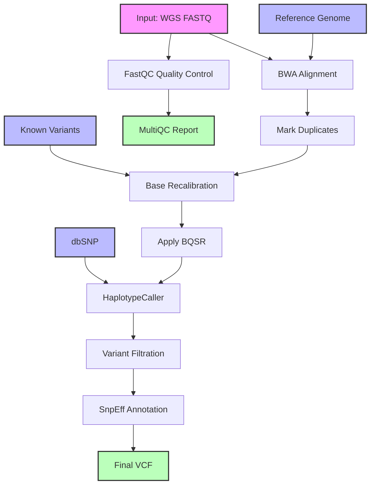

# Whole Genome Sequencing Analysis Workflow Documentation

## Overview
This document describes a Common Workflow Language (CWL) implementation of a Whole Genome Sequencing (WGS) analysis pipeline. The workflow processes whole blood WGS data, focusing on germline variant discovery following GATK best practices.

## Workflow Diagram



### Diagram Legend
- Pink boxes: Initial inputs (FASTQ files)
- Blue boxes: Reference data (Reference genome, Known variants, dbSNP)
- Green boxes: Final outputs (Final VCF, Reports)
- White boxes: Processing steps

## CWL Implementation

```yaml
#!/usr/bin/env cwl-runner

cwlVersion: v1.2
class: Workflow
label: WGS Analysis Pipeline

requirements:
  MultipleInputFeatureRequirement: {}
  ScatterFeatureRequirement: {}
  SubworkflowFeatureRequirement: {}
  InlineJavascriptRequirement: {}

inputs:
  fastq_1: File
  fastq_2: File
  reference_genome: File
  known_variants: File
  dbsnp: File
  sample_name: string

outputs:
  final_vcf:
    type: File
    outputSource: variant_annotation/annotated_vcf
  alignment_stats:
    type: File
    outputSource: alignment/alignment_stats
  multiqc_report:
    type: File
    outputSource: quality_control/multiqc_report

steps:
  quality_control:
    run: fastqc.cwl
    in:
      fastq_1: fastq_1
      fastq_2: fastq_2
    out: [fastqc_report, multiqc_report]

  alignment:
    run: bwa-mem.cwl
    in:
      fastq_1: fastq_1
      fastq_2: fastq_2
      reference: reference_genome
      sample_name: sample_name
    out: [aligned_bam, alignment_stats]

  mark_duplicates:
    run: gatk-markduplicates.cwl
    in:
      input_bam: alignment/aligned_bam
    out: [dedup_bam, metrics_file]

  base_recalibration:
    run: gatk-baserecalibrator.cwl
    in:
      input_bam: mark_duplicates/dedup_bam
      reference: reference_genome
      known_sites: known_variants
      dbsnp: dbsnp
    out: [recal_table]

  apply_bqsr:
    run: gatk-applybqsr.cwl
    in:
      input_bam: mark_duplicates/dedup_bam
      recal_table: base_recalibration/recal_table
      reference: reference_genome
    out: [recal_bam]

  haplotype_caller:
    run: gatk-haplotypecaller.cwl
    in:
      input_bam: apply_bqsr/recal_bam
      reference: reference_genome
      dbsnp: dbsnp
    out: [raw_vcf]

  variant_filtration:
    run: gatk-variantfiltration.cwl
    in:
      input_vcf: haplotype_caller/raw_vcf
      reference: reference_genome
    out: [filtered_vcf]

  variant_annotation:
    run: snpeff.cwl
    in:
      input_vcf: variant_filtration/filtered_vcf
      reference: reference_genome
    out: [annotated_vcf]
```

## Workflow Steps Description

1. **Quality Control**
   - Tool: FastQC
   - Purpose: Assesses the quality of raw sequencing data
   - Outputs: Quality metrics and MultiQC summary report

2. **Read Alignment**
   - Tool: BWA-MEM
   - Purpose: Aligns reads to reference genome
   - Key features: 
     - Optimized for longer reads
     - Supports split alignments
     - Handles paired-end data

3. **Mark Duplicates**
   - Tool: GATK MarkDuplicates
   - Purpose: Identifies and marks PCR/optical duplicates
   - Important for:
     - Reducing bias in variant calling
     - Improving data quality

4. **Base Quality Score Recalibration (BQSR)**
   - Tools: GATK BaseRecalibrator & ApplyBQSR
   - Purpose: Improves accuracy of base quality scores
   - Uses known variants to:
     - Model systematic errors
     - Adjust quality scores

5. **Variant Calling**
   - Tool: GATK HaplotypeCaller
   - Purpose: Identifies germline variants
   - Features:
     - Local de-novo assembly
     - Handles SNPs and indels simultaneously
     - Generates gVCF for cohort analysis

6. **Variant Filtration**
   - Tool: GATK VariantFiltration
   - Purpose: Filters low-quality variant calls
   - Based on:
     - Quality scores
     - Read depth
     - Strand bias

7. **Variant Annotation**
   - Tool: SnpEff
   - Purpose: Annotates variants with functional predictions
   - Provides:
     - Gene impact predictions
     - Population frequencies
     - Clinical significance

## Workflow Inputs
- fastq_1: Forward reads FASTQ file
- fastq_2: Reverse reads FASTQ file
- reference_genome: Reference genome FASTA file
- known_variants: VCF file of known variants
- dbsnp: dbSNP database VCF file
- sample_name: Sample identifier

## Workflow Outputs
- final_vcf: Annotated variant calls
- alignment_stats: BWA alignment statistics
- multiqc_report: Quality control summary report

## Resource Requirements

### Computing Resources
- CPU: Minimum 16 cores recommended
- RAM: Minimum 64GB recommended
- Storage: 
  - Temporary: 500GB-1TB
  - Final results: 100GB
- High-performance storage system recommended

### Reference Files
- Reference genome (with BWA indices)
- dbSNP database
- Known variants for BQSR
- SnpEff databases

## Best Practices and Recommendations

### Data Quality
1. Verify input FASTQ quality metrics
2. Monitor coverage statistics
3. Check duplication rates
4. Validate variant quality scores

### Performance Optimization
1. Use local SSDs for temporary files
2. Adjust Java heap size for GATK tools
3. Optimize thread count for BWA alignment
4. Consider scatter-gather for large datasets

### Quality Control Points
1. Raw data quality (FastQC metrics)
2. Alignment rates and coverage
3. Duplication rates
4. Base quality score distribution
5. Variant quality metrics
6. Ti/Tv ratios for SNPs

## Error Handling and Troubleshooting
1. Monitor resource usage
2. Check log files regularly
3. Validate intermediate outputs
4. Common issues:
   - Memory errors in BQSR
   - Disk space during sorting
   - Java heap size limitations
   - Index file mismatches

## Notes
- Pipeline follows GATK best practices
- Suitable for both research and clinical applications
- Can be extended for joint calling across multiple samples
- Regular updates recommended for reference databases