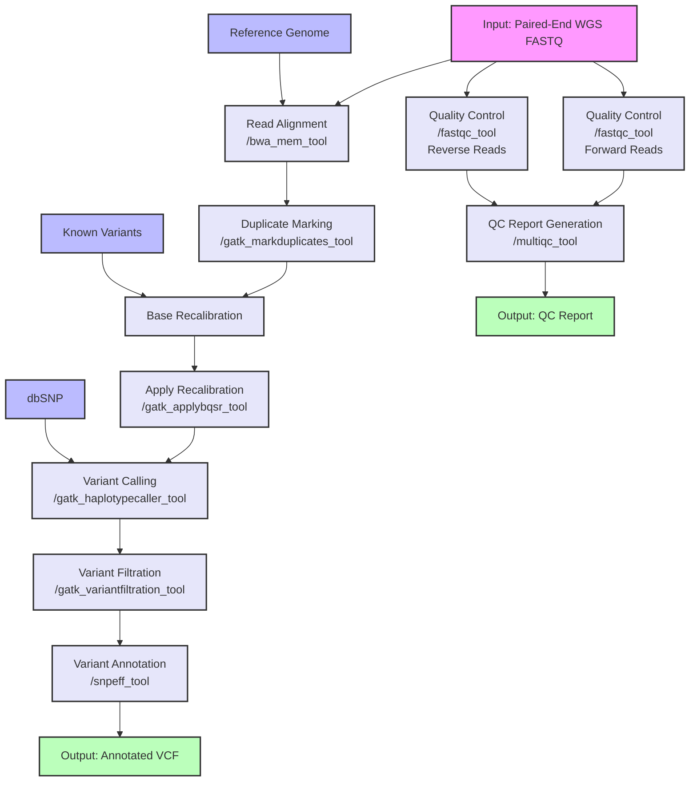

# Whole Genome Sequencing Analysis Workflow Documentation

## Overview
This document describes a Common Workflow Language (CWL) implementation of a Whole Genome Sequencing (WGS) analysis pipeline using specific tools from our tool library. The workflow processes germline WGS data from raw FASTQ files through variant calling and annotation, following GATK best practices.

## Workflow Diagram



### Diagram Legend
- Pink boxes: Initial inputs (FASTQ files)
- Blue boxes: Reference data (Reference genome, Known variants, dbSNP)
- Green boxes: Final outputs (Annotated VCF, QC reports)
- Lavender boxes: Processing steps (with specific tool IDs)

## Workflow Steps Description

1. **Quality Control**
   - Tool: `fastqc_tool` from qc_tools.cwl
   - Container: biocontainers/fastqc:0.11.9
   - Resources: 4GB RAM, 1 core
   - Purpose: Assesses the quality of raw sequencing data

2. **QC Report Generation**
   - Tool: `multiqc_tool` from qc_tools.cwl
   - Container: biocontainers/multiqc:1.12
   - Resources: 4GB RAM, 1 core
   - Purpose: Aggregates QC metrics into a single report

3. **Read Alignment**
   - Tool: `bwa_mem_tool` from alignment_tools.cwl
   - Container: biocontainers/bwa:0.7.17
   - Resources: 16GB RAM, 8 cores
   - Purpose: Maps WGS reads to the reference genome

4. **Mark Duplicates**
   - Tool: `gatk_markduplicates_tool` from variant_analysis_tools.cwl
   - Container: broadinstitute/gatk:4.3.0.0
   - Resources: 32GB RAM, 1 core
   - Purpose: Identifies and marks PCR duplicates

5. **Base Recalibration**
   - Tool: `gatk_baserecalibrator_tool` from variant_analysis_tools.cwl
   - Container: broadinstitute/gatk:4.3.0.0
   - Resources: 32GB RAM, 1 core
   - Purpose: Generates base quality score recalibration table

6. **Apply Recalibration**
   - Tool: `gatk_applybqsr_tool` from variant_analysis_tools.cwl
   - Container: broadinstitute/gatk:4.3.0.0
   - Resources: 16GB RAM, 2 cores
   - Purpose: Applies base quality score recalibration

7. **Variant Calling**
   - Tool: `gatk_haplotypecaller_tool` from variant_analysis_tools.cwl
   - Container: broadinstitute/gatk:4.3.0.0
   - Resources: 32GB RAM, 4 cores
   - Purpose: Calls germline variants through local assembly

8. **Variant Annotation**
   - Tool: `snpeff_tool` from variant_analysis_tools.cwl
   - Container: biocontainers/snpeff:5.0
   - Resources: 16GB RAM, 4 cores
   - Purpose: Annotates variants with functional predictions

## CWL Implementation

```yaml
#!/usr/bin/env cwl-runner

cwlVersion: v1.2
class: Workflow
label: WGS Analysis Pipeline

inputs:
  fastq_1: File
  fastq_2: File
  reference_genome: File
  known_variants: File
  dbsnp: File

outputs:
  final_vcf:
    type: File
    outputSource: variant_annotation/annotated_vcf
  alignment_stats:
    type: File
    outputSource: alignment/aligned_sam
  multiqc_report:
    type: File
    outputSource: multiqc/report

steps:
  quality_control_1:
    run: ../cwl-tool-library/qc_tools.cwl#fastqc_tool
    in:
      fastq_file: fastq_1
      threads: { default: 1 }
    out: [html_file, zip_file]

  quality_control_2:
    run: ../cwl-tool-library/qc_tools.cwl#fastqc_tool
    in:
      fastq_file: fastq_2
      threads: { default: 1 }
    out: [html_file, zip_file]

  multiqc:
    run: ../cwl-tool-library/qc_tools.cwl#multiqc_tool
    in:
      input_dir:
        type: Directory
        source: [quality_control_1/html_file, quality_control_2/html_file]
    out: [report]

  alignment:
    run: ../cwl-tool-library/alignment_tools.cwl#bwa_mem_tool
    in:
      reference: reference_genome
      reads1: fastq_1
      reads2: fastq_2
      threads: { default: 8 }
    out: [aligned_sam]

  mark_duplicates:
    run: ../cwl-tool-library/variant_analysis_tools.cwl#gatk_markduplicates_tool
    in:
      input_bam: alignment/aligned_sam
      output_name: { default: "marked_duplicates.bam" }
      metrics_file: { default: "duplicate_metrics.txt" }
    out: [dedup_bam, metrics]

  base_recalibration:
    run: ../cwl-tool-library/variant_analysis_tools.cwl#gatk_baserecalibrator_tool
    in:
      input_bam: mark_duplicates/dedup_bam
      reference: reference_genome
      known_sites: known_variants
    out: [recal_table]

  apply_bqsr:
    run: ../cwl-tool-library/variant_analysis_tools.cwl#gatk_applybqsr_tool
    in:
      input_bam: mark_duplicates/dedup_bam
      reference: reference_genome
      recal_table: base_recalibration/recal_table
      output_name: { default: "recalibrated.bam" }
    out: [recalibrated_bam]

  haplotype_caller:
    run: ../cwl-tool-library/variant_analysis_tools.cwl#gatk_haplotypecaller_tool
    in:
      input_bam: apply_bqsr/recalibrated_bam
      reference: reference_genome
      dbsnp: dbsnp
      output_filename: { default: "raw_variants.vcf" }
    out: [output_vcf]

  variant_annotation:
    run: ../cwl-tool-library/variant_analysis_tools.cwl#snpeff_tool
    in:
      input_vcf: haplotype_caller/output_vcf
      genome_version: "hg38"  # or appropriate reference version
    out: [annotated_vcf, stats]
```

## Resource Requirements Summary

### Computational Resources by Step
1. **Quality Control (FastQC)** - Per FASTQ file:
   - RAM: 4GB
   - CPU: 1 core
   - Storage: ~2GB
   - Time estimate: 30-60 minutes

2. **QC Report Generation (MultiQC)**
   - RAM: 4GB
   - CPU: 1 core
   - Storage: <1GB
   - Time estimate: 5-10 minutes

3. **Alignment (BWA-MEM)**
   - RAM: 16GB
   - CPU: 8 cores
   - Storage: ~150GB
   - Time estimate: 8-12 hours

4. **Mark Duplicates (GATK)**
   - RAM: 32GB
   - CPU: 1 core
   - Storage: ~150GB
   - Time estimate: 4-6 hours

5. **Base Recalibration (GATK BaseRecalibrator)**
   - RAM: 32GB
   - CPU: 1 core
   - Storage: ~50GB
   - Time estimate: 4-6 hours

6. **Apply BQSR (GATK ApplyBQSR)**
   - RAM: 16GB
   - CPU: 2 cores
   - Storage: ~150GB
   - Time estimate: 4-6 hours

7. **Variant Calling (GATK HaplotypeCaller)**
   - RAM: 32GB
   - CPU: 4 cores
   - Storage: ~50GB
   - Time estimate: 24-48 hours

8. **Variant Annotation (SnpEff)**
   - RAM: 16GB
   - CPU: 4 cores
   - Storage: ~20GB
   - Time estimate: 2-4 hours

### Total Resource Requirements
- Peak RAM: 32GB
- Optimal CPU: 8+ cores
- Total Storage: ~600GB per sample
- Total Runtime: 48-72 hours per sample

## Error Handling and Monitoring

### Key Monitoring Points
1. FastQC output metrics
   - Sequence quality scores
   - GC content
   - Duplication rates
   - Coverage uniformity

2. BWA alignment statistics
   - Mapping rate
   - Insert size distribution
   - Coverage depth
   - Coverage breadth

3. GATK metrics
   - Duplication rate
   - Base quality score distribution
   - Variant calling metrics
   - Ti/Tv ratio

### Common Error Points and Solutions
1. **Insufficient Memory**
   - Symptom: Java heap space errors
   - Solution: Increase RAM allocation in tool resource requirements

2. **Storage Issues**
   - Symptom: No space left on device
   - Solution: Monitor storage usage, implement cleanup steps

3. **Coverage Issues**
   - Symptom: Low or uneven coverage
   - Solution: Check sequencing quality, adjust library prep

## Quality Control Thresholds

### FastQC Metrics
- Base quality: >Q20 for
