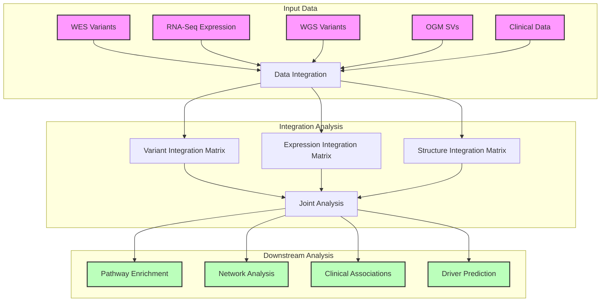

# Workflow 04: Multi-omics Integration Analysis

## Overview
This workflow integrates data from WES (Workflow 1), RNA-Seq (Workflow 2), WGS (Workflow 3), and Optical Genome Mapping to perform comprehensive multi-omics analysis.



## Integration Components

### 1. Data Preparation
- **Variant Matrix Creation**
  - Convert VCF to matrix format
  - Harmonize variant annotations
  - Create binary presence/absence matrix
  - Map variants to genes

- **Expression Matrix Creation**
  - Normalize expression counts
  - Batch correction
  - Sample normalization
  - Create gene x sample matrix

- **Structure Matrix Creation**
  - Convert SV calls to matrix format
  - Integrate OGM data
  - Create positional overlap matrix

### 2. Primary Integration Steps

#### Variant-Expression Integration
- Correlation analysis between variants and expression
- eQTL analysis
- Differential expression by variant status
- Splicing impact analysis

#### Variant-Structure Integration
- SV validation using OGM data
- Complex variant analysis
- Breakpoint analysis
- Copy number integration

#### Clinical Integration
- Survival analysis
- Phenotype associations
- Treatment response correlations
- Biomarker identification

### 3. Advanced Analysis

#### Network Analysis
- Protein-protein interaction networks
- Co-expression networks
- Regulatory networks
- Pathway impact analysis

#### Driver Analysis
- Integration-based driver scoring
- Pathway enrichment
- Mutual exclusivity analysis
- Clinical impact prediction

## Required Tools

### Data Integration
- MutSigCV
- MOFA+
- iCluster+
- PARADIGM
- mixOmics

### Statistical Analysis
- R packages:
  - DESeq2
  - limma
  - survival
  - maftools
  - ComplexHeatmap

### Network Analysis
- Cytoscape
- NetworkX
- iGraph
- ReactomeFI

### Visualization
- ggplot2
- plotly
- circos
- upset

## Input Requirements

### Variant Data
```yaml
required_files:
  - somatic_variants.vcf
  - germline_variants.vcf
  - cnv_calls.seg
  - sv_calls.bedpe
```

### Expression Data
```yaml
required_files:
  - normalized_counts.tsv
  - differential_expression.tsv
  - fusion_calls.tsv
```

### Structural Data
```yaml
required_files:
  - ogm_sv_calls.txt
  - wgs_sv_calls.vcf
  - breakpoint_info.bed
```

### Clinical Data
```yaml
required_files:
  - clinical_annotations.tsv
  - survival_data.tsv
  - treatment_data.tsv
```

## Output Specifications

### Primary Outputs
1. Integrated feature matrix
2. Multi-omics clusters
3. Driver gene predictions
4. Network modules
5. Clinical associations

### QC Metrics
1. Integration quality scores
2. Batch effect assessments
3. Missing data reports
4. Technical artifact screening

## Resource Requirements

### Computational
- RAM: 128GB minimum
- CPU: 32 cores recommended
- Storage: 500GB per analysis
- GPU: Optional for deep learning

### Time Estimates
- Data preparation: 1-2 days
- Integration analysis: 2-3 days
- Network analysis: 1-2 days
- Visualization: 1 day

## Quality Control

### Integration QC
1. Sample clustering validation
2. Batch effect assessment
3. Missing data impact
4. Technical artifact screening

### Biological QC
1. Known pathway validation
2. Gene set enrichment
3. Clinical correlation validation
4. Literature-based validation

## Best Practices

### Data Preparation
1. Standardize feature names across modalities
2. Handle missing data appropriately
3. Scale and normalize appropriately
4. Document data transformations

### Analysis
1. Use multiple integration methods
2. Validate findings across approaches
3. Consider biological context
4. Assess clinical relevance

### Reporting
1. Document all parameters
2. Record software versions
3. Save intermediate results
4. Generate reproducible reports

## Common Challenges

### Technical Challenges
1. Batch effects
2. Missing data
3. Integration method selection
4. Computational resources

### Biological Challenges
1. Sample heterogeneity
2. Pathway complexity
3. Clinical interpretation
4. Causality inference

## Validation Strategy

### Internal Validation
1. Cross-validation
2. Bootstrapping
3. Permutation testing
4. Sensitivity analysis

### External Validation
1. Literature comparison
2. Independent cohort validation
3. Experimental validation
4. Clinical correlation

## Reporting Requirements

### Technical Report
1. Methods description
2. Parameter settings
3. QC metrics
4. Performance statistics

### Biological Report
1. Key findings
2. Pathway analysis
3. Clinical correlations
4. Actionable insights
