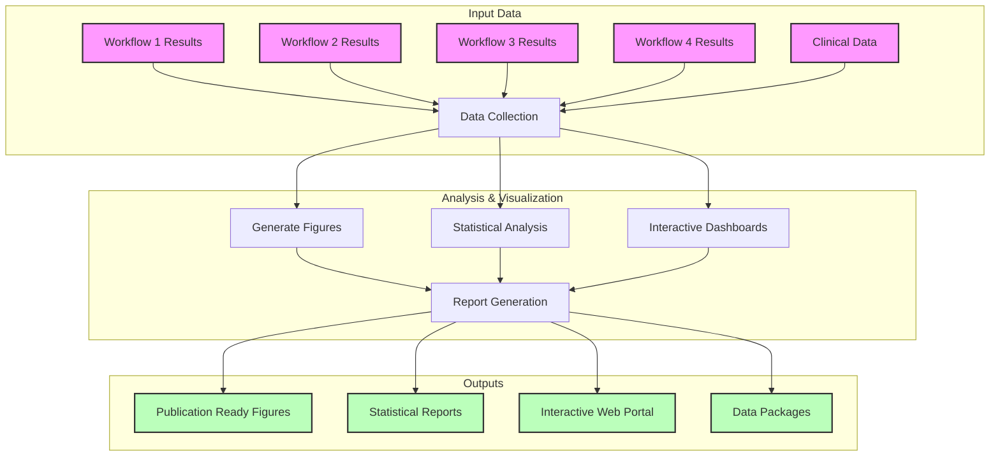

# Workflow 5: Downstream Analysis and Visualization

## Overview
This workflow focuses on the visualization, interpretation, and reporting of results from previous workflows (1-4). It includes automated report generation, interactive visualizations, and data packaging for publication.



## Components

### 1. Publication-Ready Figures
- **Genomic Visualizations**
  - Mutation landscapes (OncoPrint)
  - Copy number profiles
  - Structural variant maps
  - Circle plots for genome-wide events

- **Expression Analysis**
  - Heatmaps
  - Volcano plots
  - PCA/UMAP plots
  - Gene expression boxplots

- **Integration Visualizations**
  - Multi-omics clustering
  - Network diagrams
  - Pathway maps
  - Clinical correlation plots

### 2. Statistical Reports
- **Summary Statistics**
  - Sample characteristics
  - Mutation frequencies
  - Expression patterns
  - Clinical correlations

- **Advanced Analytics**
  - Survival analysis
  - Multivariate regression
  - Enrichment analysis
  - Power calculations

### 3. Interactive Dashboards
- **Web Portal Features**
  - Sample browser
  - Gene-level explorer
  - Pathway viewer
  - Clinical data integration

## Required Tools

### Visualization Tools
```yaml
R_packages:
  - ggplot2
  - ComplexHeatmap
  - circlize
  - plotly
  - survminer

Python_packages:
  - matplotlib
  - seaborn
  - plotly
  - dash
  - bokeh

Other_tools:
  - GraphViz
  - Cytoscape
  - IGV
  - UCSC Genome Browser
```

### Report Generation
```yaml
frameworks:
  - R Markdown
  - Jupyter Notebooks
  - Sphinx
  - MkDocs

publishing_tools:
  - LaTeX
  - Pandoc
  - ImageMagick
```

## Input Requirements

### From Previous Workflows
```yaml
workflow1_results:
  - somatic_variants_final.vcf
  - cnv_results_final.seg
  - quality_metrics.tsv

workflow2_results:
  - expression_matrix_final.tsv
  - differential_expression.tsv
  - pathway_analysis.tsv

workflow3_results:
  - germline_variants_filtered.vcf
  - structural_variants.bedpe
  - coverage_statistics.tsv

workflow4_results:
  - integrated_clusters.tsv
  - multi_omics_features.tsv
  - network_modules.gml
```

## Output Specifications

### Figure Sets
1. Main Figures (Publication Quality)
   - Resolution: 300+ DPI
   - Format: PDF, SVG, TIFF
   - Size: Journal specifications

2. Supplementary Figures
   - Extended data visualizations
   - Additional analyses
   - Method illustrations

### Reports
1. Technical Documentation
   - Methods descriptions
   - Parameter settings
   - Quality metrics
   - Reproducibility instructions

2. Biological Interpretation
   - Key findings
   - Clinical implications
   - Validation results
   - Future directions

### Interactive Resources
1. Web Portal
   - Data browser
   - Visualization tools
   - Download options
   - Documentation

2. Analysis Notebooks
   - Reproducible code
   - Analysis workflows
   - Example usage
   - Troubleshooting guides

## Best Practices

### Figure Generation
1. **Style Guidelines**
   - Consistent color schemes
   - Standardized fonts
   - Clear labels
   - Appropriate scales

2. **Quality Control**
   - Resolution check
   - Color accessibility
   - Size verification
   - Format validation

### Report Writing
1. **Structure**
   - Clear sections
   - Logical flow
   - Executive summary
   - Detailed methods

2. **Documentation**
   - Version control
   - Parameter logging
   - Error handling
   - Update tracking

## Resource Requirements

### Computational
- RAM: 64GB recommended
- CPU: 16 cores
- Storage: 1TB for all outputs
- GPU: For complex visualizations

### Software
- R (latest version)
- Python (3.8+)
- LaTeX distribution
- Web server for dashboards

## Quality Control

### Figure QC
1. Resolution verification
2. Color scheme validation
3. Format compatibility
4. Size requirements

### Report QC
1. Content accuracy
2. Method verification
3. Result validation
4. Citation checking

## Automation Features

### Automated Reports
1. Daily progress reports
2. Quality metric summaries
3. Error notifications
4. Status updates

### Pipeline Integration
1. Continuous integration
2. Automated testing
3. Version control
4. Documentation updates

## Data Sharing

### Publication Package
1. Raw data availability
2. Processing pipelines
3. Analysis code
4. Figure generation scripts

### Repository Structure
1. Organized directories
2. Clear documentation
3. Version control
4. Access controls

## Maintenance Plan

### Regular Updates
1. Software versions
2. Documentation
3. Web resources
4. Security patches

### Archive Strategy
1. Data backup
2. Version archiving
3. Documentation preservation
4. Access logs
